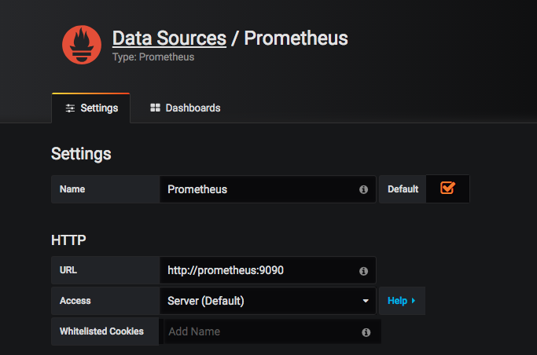
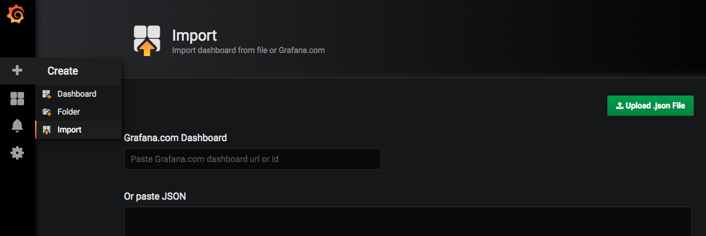

# Реализация Hello World в Docker


Предварительные замечания:
На хост системе должны быть уже установлены:
 - docker
 - docker-compose
  
## Шаг 1. Выкачиваем сырцы

```shell
git clone 
```

## Шаг 2. Выставляем права на директорию

```shell
cd demo_app
bash ./make_demo_app.sh
```

## Шаг 3. Поднимаем докер контейнеры 
* Будет поднят стек Prometheus + Grafana
* Будет поднят в той же сети контейнер node-exporter (опционально поднимается для демо)
* В автоматическом режиме будет произведен сборка Docker контейнера приложения


Для разворачивания необходимо произвести:

```shell
cd /demo_app
docker-compose up -d
```

## Шаг 4. Подключаем Grafana к datasource Prometheus



## Шаг 5. Импортируем дашбоард


